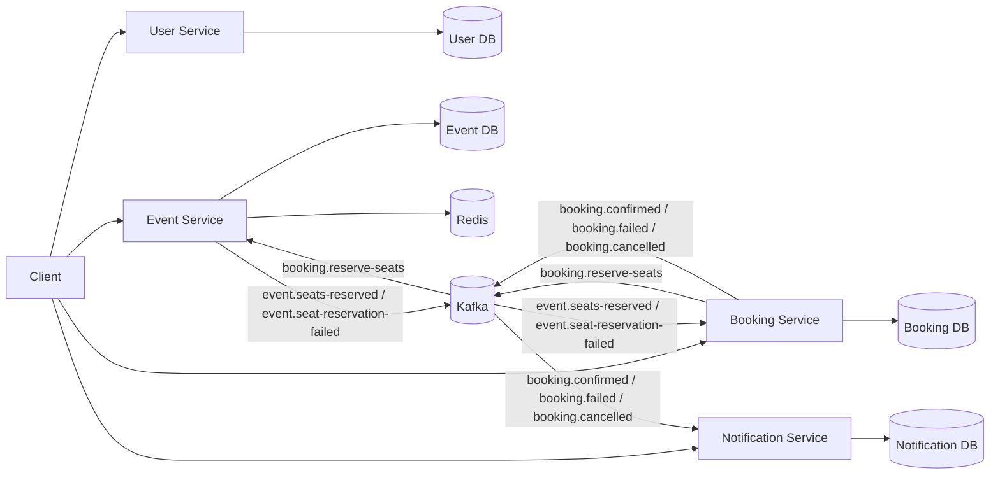

# Event Booking System

## Overview

A small **Node.js/TypeScript** microservices monorepo implementing an event booking platform. It demonstrates:
- **Four services**: User, Event, Booking, Notification
- **PostgreSQL** database per service (except Notification which uses an in‑memory store for the demo)
- **Kafka** asynchronous workflows with outbox/inbox patterns
- **Redis** cache‑aside for event reads and fixed‑window rate limiting
- **Transactional inbox/outbox** for exactly‑once side‑effects
- **Docker Compose** for local development and **Helm** for Kubernetes deployments
- **CI/CD** pipelines with lint, format, type‑check, tests, migrations, load‑testing, Docker builds, Helm validation, and dependency audit

## Architecture



| Service | Responsibility | Database | External Dependencies |
|---|---|---|---|
| **User Service** | User CRUD | PostgreSQL (user-db) | None |
| **Event Service** | Event CRUD, seat inventory, Redis cache‑aside | PostgreSQL (event-db) | Redis, Kafka |
| **Booking Service** | Booking creation, idempotency, state machine, outbox publishing | PostgreSQL (booking-db) | Kafka |
| **Notification Service** | Consume booking lifecycle events, expose stored notifications | PostgreSQL (notification-db) | Kafka |

## Booking Lifecycle

1. **POST /bookings** creates a booking in **PENDING** state and publishes `booking.reserve-seats`.
2. **Event Service** consumes the request and performs an **atomic seat reservation** (`UPDATE … SET available_seats = available_seats - qty WHERE available_seats >= qty`).
3. On success it publishes `event.seats‑reserved`; on failure `event.seat‑reservation‑failed`.
4. **Booking Service** consumes the outcome and transitions the booking to **CONFIRMED** or **FAILED** and publishes the corresponding lifecycle event.
5. **Notification Service** consumes the lifecycle event and stores a notification for demo visibility.

The flow is **eventually consistent** – the HTTP response returns the initial `PENDING` booking; the final status is observed via a follow‑up GET.

## Cancellation Lifecycle

1. A confirmed booking can be cancelled via `POST /bookings/:id/cancel`.
2. The service publishes `booking.cancelled`.
3. **Event Service** consumes the cancellation and atomically releases the seats (`available_seats = available_seats + qty` guarded by `available_seats + qty <= total_seats`).
4. A notification is emitted.

Concurrent cancellation is protected by the same **atomic SQL guard** and the outbox row‑claiming mechanism.

## Race‑Condition Prevention

Seat reservation never uses a **read‑check‑write** pattern. Instead it executes a single guarded `UPDATE` statement:

```sql
UPDATE events
SET available_seats = available_seats - $1
WHERE id = $2
  AND available_seats >= $1
RETURNING *;
```

The invariant `0 ≤ available_seats ≤ total_seats` and `reserved_seats = total_seats - available_seats` is enforced by the database. PostgreSQL concurrency tests verify that overselling cannot occur.

## Idempotency

- **Idempotency‑Key** header on the booking creation endpoint.
- The service stores a canonical fingerprint of the request. Repeating the same key with identical payload returns the original booking. Repeating the key with a different payload yields `409 IDEMPOTENCY_KEY_REUSED`.
- The implementation is safe against concurrent duplicate HTTP requests.

## Messaging Reliability

- **Kafka** provides **at‑least‑once** delivery.
- Every message is wrapped in a shared envelope (`messageId`, `correlationId`, `timestamp`, `version`, `payload`).
- **Inbox** deduplication records processed `messageId`s before applying side‑effects.
- **Outbox** records are persisted with the same transaction as the business state and are claimed by workers using `FOR UPDATE SKIP LOCKED`.
- Failed outbox records transition to a `FAILED` state and are sent to a **DLQ** after exponential backoff.

## Redis

- Cache‑aside reads for events (`event:{eventId}` keys).
- Cache misses populate Redis from PostgreSQL; writes/updates/invalidation delete the key.
- **Fixed‑window** rate limiting is implemented with an atomic Lua script (`INCR` + `EXPIRE`).
- Cache failures fall back to PostgreSQL (fail‑open).

## Database Integrity

- `quantity > 0`, `totalSeats > 0`.
- `availableSeats >= 0` and `availableSeats <= totalSeats` enforced by CHECK constraints.
- Prisma migrations are **forward‑only**; tests run against fresh migrations and upgrade paths.

## Notification Durability

- Notification Service now persists notifications in PostgreSQL (previously in‑memory) and stores a `processed_message_id` to deduplicate across replicas.

## API (selected endpoints)

| Service | Method | Path |
|---|---|---|
| User | POST | `/users` |
| User | GET | `/users/:id` |
| Event | POST | `/events` |
| Event | GET | `/events/:id` |
| Booking | POST | `/bookings` (Idempotency‑Key) |
| Booking | GET | `/bookings/:id` |
| Booking | POST | `/bookings/:id/cancel` |
| Notification | GET | `/notifications` |

Pagination parameters (`page`, `pageSize`) are supported on list endpoints; the maximum `pageSize` is **100**.

Error codes of interest:
- `CAPACITY_BELOW_RESERVED_SEATS`
- `IDEMPOTENCY_KEY_REUSED`

OpenAPI / Postman collection is available at `docs/Event_Booking_System.postman_collection.json`.

## Quick Start

### Prerequisites

- Node.js **22**
- `corepack` enabled (`corepack enable`)
- Docker & Docker‑Compose
- Helm 3 (for Kubernetes path)
- (Optional) Minikube for local K8s testing

### Install dependencies

```bash
corepack pnpm install --frozen-lockfile
```

### Build & Test

```bash
corepack pnpm build
corepack pnpm test
corepack pnpm typecheck
corepack pnpm test:e2e
```

### Local Development (Docker Compose)

```bash
docker compose up --build
```

The stack starts the following containers:
- `user-db`, `event-db`, `booking-db` (PostgreSQL)
- `redis`
- `kafka`
- `user-service`, `event-service`, `booking-service`, `notification-service`

Health endpoints:
- Liveness: `GET /health/live`
- Readiness: `GET /health/ready`

### Kubernetes (Helm) Deployment

```bash
./scripts/deploy.sh dev   # dev environment
./scripts/deploy.sh staging   # staging environment
./scripts/deploy.sh prod   # production environment
```

Helm chart lives in `infrastructure/helm/event-booking`. **Kustomize** is legacy and no longer supported.

### Load Testing (k6)

```bash
# Smoke profile (basic functional checks)
k6 run k6/smoke.js

# Overselling protection profile (high concurrency)
k6 run k6/overselling.js

# Steady‑state load profile
k6 run k6/steady.js
```

The tests verify that the **inventory invariant** (`availableSeats + reservedSeats = totalSeats`) holds under load.

### Code Quality Checks

```bash
pnpm format:check
pnpm lint
pnpm typecheck
pnpm build
```

### Observability

- Liveness: `GET /health/live`
- Readiness: `GET /health/ready`
- Metrics (Prometheus format): `GET /metrics`

### Docker Images

- Multi‑stage Dockerfiles produce **production‑only** images.
- Containers run as a **non‑root user** and the application filesystem is **read‑only**.
- Prisma CLI is retained only for migrations.

### CI / CD (GitHub Actions)

The workflow validates:
- frozen lockfile install
- formatting & linting
- type‑checking
- build
- unit, migration, and e2e tests
- concurrency tests (PostgreSQL race‑condition suite)
- k6 smoke test
- Docker image builds (production stage only)
- Helm lint & chart rendering for all values files
- `pnpm audit --prod --audit-level high` (reports a transitive Prisma advisory; no forced upgrade was applied because the vulnerable code is not imported by the application)

## Security & Production Considerations

- Secrets are supplied externally (environment variables or Kubernetes secrets).
- Containers run as a non‑root user with a read‑only filesystem where possible.
- Security contexts are defined in the Helm chart.
- Image scanning is recommended before publishing to a registry.
- The bundled infrastructure is **assessment‑sized** (single‑node Kafka/Postgres/Redis) and not intended for HA production use.
- Known Prisma CLI transitive advisory is reported by `pnpm audit`; it does **not** affect the runtime code.

## Known Trade‑offs

- Single‑node deployment of Kafka, PostgreSQL, and Redis for simplicity.
- Process‑local Prometheus counters reset on container restart.
- Readiness probe only checks Kafka consumer startup, not a full broker round‑trip.
- Pagination endpoints do not expose a total count to avoid an extra count query.

---

*All documentation now reflects the current implementation exactly.*

Node.js microservices monorepo for an event booking system. The current implementation includes:

- `user-service` for user CRUD
- `event-service` for event CRUD, Redis cache-aside reads, and atomic seat reservation/release
- `booking-service` for booking creation, idempotency, state transitions, and outbox publishing
- `notification-service` for consuming booking lifecycle events and exposing stored notifications
- shared packages for Kafka contracts, logging, messaging, and test utilities
- Docker Compose and Helm-based deployment paths

See [`docs/architecture.md`](docs/architecture.md) for the detailed flow and tradeoffs.

## Repository Layout

- `services/user-service` - user API and PostgreSQL persistence
- `services/event-service` - event API, inventory, Redis cache, Kafka consumers/producers
- `services/booking-service` - booking API, idempotent create/cancel flow, outbox processing
- `services/notification-service` - notification consumer and read API
- `packages/contracts` - shared Kafka message contracts and enums
- `packages/logger` - shared structured logging
- `packages/messaging` - shared Kafka client wrappers
- `packages/test-utils` - shared test helpers
- `infrastructure/helm/event-booking` - Helm chart used by the deployment scripts
- `infrastructure/legacy-kustomize` - legacy manifests kept for reference only
- `scripts` - deployment and Minikube helpers
- `docs/Event_Booking_System.postman_collection.json` - Postman collection for manual API testing

## Tech Stack

- Node.js 22
- TypeScript
- Express
- Prisma
- PostgreSQL
- Redis
- Kafka in KRaft mode
- Docker Compose
- Helm and Minikube
- Vitest and Supertest

## Prerequisites

- Node.js 22
- `corepack` enabled
- Docker and Docker Compose
- Helm 3
- Minikube for the Kubernetes path
- Docker must be able to pull `node:22-alpine` from Docker Hub when building images, or that base image must already exist in the active Docker daemon

## Install

```bash
corepack pnpm install --frozen-lockfile
```

## Build And Test

```bash
corepack pnpm build
corepack pnpm test
corepack pnpm typecheck
corepack pnpm test:e2e
```

The root scripts run the workspace packages in dependency order. `test` builds first, then runs the service test suites.

## Local Development With Docker Compose

Run the full stack locally:

```bash
docker compose up --build
```

The compose file starts:

- `user-db`
- `event-db`
- `booking-db`
- `redis`
- `kafka`
- `user-service`
- `event-service`
- `booking-service`
- `notification-service`

Each service has a health endpoint at `/health/live` and `/health/ready`. The service containers run Prisma migrations through one-shot migration containers before the app containers start.

For a clean E2E run:

```bash
docker compose down -v --remove-orphans
corepack pnpm test:e2e
```

## Deployment

The main deployment entrypoint is [`scripts/deploy.sh`](scripts/deploy.sh).

Usage:

```bash
./scripts/deploy.sh [dev|staging|prod]
```

Defaults:

- environment: `dev`

### Deployment Environments

The supported path is Helm through `scripts/deploy-helm.sh`:
   - Deploys the Helm chart located in `infrastructure/helm/event-booking`.
   - Uses `values.yaml` plus environment overlay (`values-dev.yaml`, `values-staging.yaml`, or `values-prod.yaml`).
   - Target namespace: `event-booking-${ENV}`.

### Usage Examples:

```bash
# Helm deployments
./scripts/deploy.sh dev
./scripts/deploy.sh staging
./scripts/deploy.sh prod
```

Notes:

- `prod` expects externally published registry images with immutable Git SHA tags; checked-in registry repositories and SHA values are placeholders.
- The deploy scripts ensure `node:22-alpine` is available before building. In Minikube mode, images are built using the host Docker daemon and loaded directly into the active Minikube cluster via `minikube image load`.

### Minikube Flow

This starts the configured Minikube profile if needed, builds local service images, and deploys the Helm release with `values-minikube.yaml`.

The Minikube deploy script also waits for the main workloads and starts local port-forwards:

- `http://localhost:3000` - user service
- `http://localhost:3001` - event service
- `http://localhost:3002` - booking service
- `http://localhost:3003` - notification service

## Service APIs

| Service      | Method | Path                               |
| ------------ | ------ | ---------------------------------- |
| User         | POST   | `/users`                           |
| User         | GET    | `/users`                           |
| User         | GET    | `/users/:id`                       |
| Event        | POST   | `/events`                          |
| Event        | GET    | `/events`                          |
| Event        | GET    | `/events/:id`                      |
| Event        | PUT    | `/events/:id`                      |
| Event        | DELETE | `/events/:id`                      |
| Booking      | POST   | `/bookings`                        |
| Booking      | GET    | `/bookings/:id`                    |
| Booking      | GET    | `/bookings/users/:userId/bookings` |
| Booking      | POST   | `/bookings/:id/cancel`             |
| Notification | GET    | `/notifications`                   |

The booking create endpoint supports the `Idempotency-Key` header.

## Event Flow

1. Booking Service publishes `booking.reserve-seats`.
2. Event Service consumes the reservation request and applies an atomic seat update.
3. Event Service publishes `event.seats-reserved` or `event.seat-reservation-failed`.
4. Booking Service consumes the outcome and transitions the booking to `CONFIRMED` or `FAILED`.
5. Booking Service publishes `booking.confirmed`, `booking.failed`, or `booking.cancelled`.
6. Notification Service consumes booking lifecycle events and records notifications for demo visibility.

## Redis Caching

- Event Service uses Redis as cache-aside storage for event reads.
- Cache keys follow the `event:{eventId}` pattern.
- Reads populate Redis on cache misses.
- Updates, deletes, reservations, and releases invalidate the cached event.

## Data Ownership

- User Service uses PostgreSQL
- Event Service uses PostgreSQL and Redis
- Booking Service uses PostgreSQL
- Notification Service keeps notifications in memory for the demo flow

No service reads another service's database directly.

## Postman Collection

Import [`docs/Event_Booking_System.postman_collection.json`](docs/Event_Booking_System.postman_collection.json) into Postman to exercise the HTTP APIs manually.
