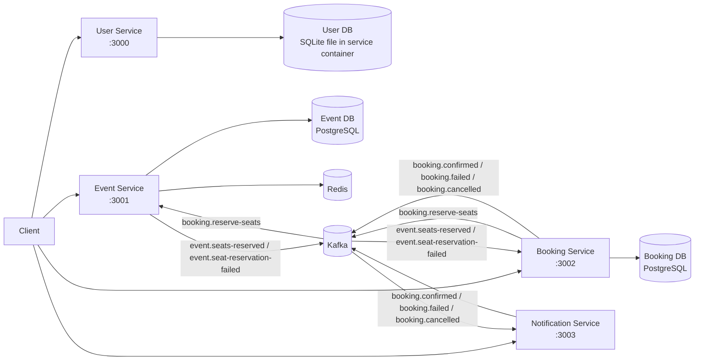

# Event Booking System Microservices

Event Booking System is a Node.js microservices monorepo built for a technical assessment. It implements a user service, event service, booking service, and notification service with PostgreSQL, Redis, Kafka, Docker Compose, Kustomize, and Minikube-ready Kubernetes manifests.

## Overview

The system supports the full booking flow:

1. Create a user.
2. Create an event with a fixed seat inventory.
3. Create a booking request.
4. Publish a Kafka reservation message.
5. Reserve seats atomically in the event service.
6. Confirm or fail the booking in the booking service.
7. Record booking notifications in the notification service.

The core correctness goal is to prevent overselling under concurrency.

## Architecture



### Service responsibilities

- User Service: create and fetch users, validate unique email addresses, own the user database.
- Event Service: create, read, update, and delete events; manage seat inventory; cache event reads in Redis; process seat reservation and release messages.
- Booking Service: create booking requests, enforce idempotency, publish seat reservation requests, update booking status from Kafka responses, and support cancellation.
- Notification Service: consume booking lifecycle events and store/log notifications.

## Technology Stack

- Node.js 22
- TypeScript
- Express
- Prisma ORM
- PostgreSQL
- Redis
- Kafka
- Vitest
- Supertest
- Docker
- Docker Compose
- Kubernetes manifests for Minikube
- pnpm workspaces

## Repository Structure

```text
event-booking-system-microservices/
├── services/
│   ├── user-service/
│   ├── event-service/
│   ├── booking-service/
│   └── notification-service/
├── packages/
│   ├── contracts/
│   ├── logger/
│   ├── messaging/
│   └── test-utils/
├── infrastructure/
│   └── kubernetes/
├── tests/
│   └── e2e/
├── scripts/
├── docs/
├── docker-compose.yml
├── package.json
├── pnpm-workspace.yaml
├── vitest.e2e.config.ts
└── README.md
```

## Service Ports

- User Service: `3000`
- Event Service: `3001`
- Booking Service: `3002`
- Notification Service: `3003`
- Kafka in Docker Compose: `9092`
- Redis in Docker Compose: `6379`
- PostgreSQL databases: `5432` inside the Compose network

## Database Ownership

Each service owns its own data boundary.

- User Service: SQLite file database inside the container, mounted via `/data/dev.db` in Minikube and `services/user-service/dev.db` in Docker Compose.
- Event Service: its own PostgreSQL database.
- Booking Service: its own PostgreSQL database.
- Notification Service: in-memory notification store for the current implementation.

No service reads another service’s database directly.

## API Endpoints

### User Service

- `POST /users`
- `GET /users/:id`
- `GET /users`
- `GET /health/live`
- `GET /health/ready`

### Event Service

- `POST /events`
- `GET /events`
- `GET /events/:id`
- `PUT /events/:id`
- `DELETE /events/:id`
- `GET /health/live`
- `GET /health/ready`

### Booking Service

- `POST /bookings`
- `GET /bookings/:id`
- `GET /users/:userId/bookings`
- `POST /bookings/:id/cancel`
- `GET /health/live`
- `GET /health/ready`

### Notification Service

- `GET /notifications`
- `GET /health/live`
- `GET /health/ready`

## Kafka Topics and Message Flow

Shared topics live in [`packages/contracts/src/index.ts`](packages/contracts/src/index.ts).

Topics used by the current implementation:

- `booking.reserve-seats`
- `event.seats-reserved`
- `event.seat-reservation-failed`
- `booking.release-seats`
- `booking.confirmed`
- `booking.failed`
- `booking.cancelled`

Flow:

1. Booking Service creates a `PENDING` booking and publishes `booking.reserve-seats`.
2. Event Service consumes the reservation request and applies the atomic seat update.
3. If the reservation succeeds, Event Service publishes `event.seats-reserved`.
4. If the reservation fails, Event Service publishes `event.seat-reservation-failed`.
5. Booking Service consumes the event and moves the booking to `CONFIRMED` or `FAILED`.
6. Booking Service publishes the final booking lifecycle event.
7. Notification Service consumes booking lifecycle events and stores them for display.

### Message envelope

Messages use a common envelope with:

- `messageId`
- `correlationId`
- `timestamp`
- `version`
- `payload`

The contracts package also includes the optional `eventId` field on the envelope.

## Redis Caching Strategy

Redis belongs to the Event Service.

- Cache key pattern: `event:{eventId}`
- Cache-aside read path:
  - check Redis first
  - on miss, read PostgreSQL
  - write the event back to Redis with a TTL
- Cache invalidation happens after:
  - event update
  - event delete
  - successful seat reservation
  - successful seat release

The current TTL is controlled by `CACHE_TTL_SECONDS` and defaults to `120` seconds in the service config.

## Race-Condition-Safe Booking

The Event Service uses atomic seat updates instead of read-check-write logic.

Conceptually, the seat reservation uses a statement like:

```sql
UPDATE events
SET available_seats = available_seats - $1
WHERE id = $2
  AND available_seats >= $1
RETURNING *;
```

Why this matters:

- The unsafe pattern is:
  - read available seats
  - compare in application code
  - write the new value
- That pattern can oversell when concurrent requests read the same seat count before either write completes.
- The atomic `UPDATE ... WHERE available_seats >= quantity` prevents overselling at the database level.

The concurrency e2e test demonstrates this under load.

## Idempotency Strategy

Booking Service supports client idempotency keys.

- Clients send `Idempotency-Key` with the booking request.
- The booking service stores the request/response mapping.
- Replaying the same key returns the existing booking instead of creating a new one.
- Kafka consumers also check processed message IDs to avoid duplicate handling.

## Transactional Outbox / Inbox

Implemented in the Booking Service and Event Service flow.

- Booking Service stores booking changes together with outbox events in the database.
- A background dispatcher publishes outbox records to Kafka.
- Event Service and Booking Service record processed message IDs before handling duplicates.

This keeps message handling repeatable and reduces the chance of losing events when a service crashes after a database write.

## Health Endpoints

Every Node.js service exposes:

- `GET /health/live`
- `GET /health/ready`

The readiness checks are wired into the Docker Compose health checks and the Kubernetes probes.

## Docker Compose Setup

Docker Compose starts:

- `user-db`
- `event-db`
- `booking-db`
- `redis`
- `kafka`
- `user-service`
- `event-service`
- `booking-service`
- `notification-service`

Run the stack:

```bash
docker compose up --build
```

Helpful commands:

```bash
docker compose ps
docker compose down -v
```

## Minikube / Kubernetes Setup

Kubernetes manifests live in [`infrastructure/kubernetes/`](infrastructure/kubernetes).

The repo includes:

- a base Kustomize overlay
- a Minikube overlay
- namespace, ConfigMap, and Secret template manifests
- Deployments and Services for all four Node.js services
- Postgres StatefulSets for the event and booking databases
- Redis and Kafka manifests

Start and deploy with:

```bash
./scripts/minikube-start.sh
```

If Minikube is already running:

```bash
./scripts/minikube-deploy.sh
```

The scripts:

- start Minikube with the Docker driver
- switch the Docker daemon to Minikube
- build local service images
- apply the Kustomize overlay
- wait for rollouts
- print pods and services

For local access, use port-forwarding:

```bash
kubectl -n event-booking port-forward svc/user-service 3000:3000
kubectl -n event-booking port-forward svc/event-service 3001:3001
kubectl -n event-booking port-forward svc/booking-service 3002:3002
kubectl -n event-booking port-forward svc/notification-service 3003:3003
```

## Environment Variables

### Root / Compose / Minikube

- `NODE_ENV`
- `PORT`
- `DATABASE_URL`
- `REDIS_URL`
- `KAFKA_BROKERS`
- `KAFKA_CLIENT_ID`
- `KAFKA_GROUP_ID`
- `CACHE_TTL_SECONDS`
- `LOG_LEVEL`

### User Service

- `DATABASE_URL`
- `PORT`
- `LOG_LEVEL`

### Event Service

- `DATABASE_URL`
- `REDIS_URL`
- `KAFKA_BROKERS`
- `KAFKA_CLIENT_ID`
- `KAFKA_GROUP_ID`
- `CACHE_TTL_SECONDS`
- `PORT`
- `LOG_LEVEL`

### Booking Service

- `DATABASE_URL`
- `KAFKA_BROKERS`
- `KAFKA_CLIENT_ID`
- `KAFKA_GROUP_ID`
- `PORT`
- `LOG_LEVEL`

### Notification Service

- `KAFKA_BROKERS`
- `KAFKA_CLIENT_ID`
- `KAFKA_GROUP_ID`
- `PORT`
- `LOG_LEVEL`

## Migrations

The repo uses Prisma for service-local schemas.

Relevant files:

- [`services/user-service/prisma/schema.prisma`](services/user-service/prisma/schema.prisma)
- [`services/event-service/prisma/schema.prisma`](services/event-service/prisma/schema.prisma)
- [`services/booking-service/prisma/schema.prisma`](services/booking-service/prisma/schema.prisma)

The current implementation also creates some tables during startup/test bootstrap where needed, especially for the assessment-oriented integration flow.

## Tests

### Build

```bash
corepack pnpm build
```

### Unit and integration tests

```bash
corepack pnpm test
```

This runs the workspace build first and then each package’s test suite.

### E2E tests

```bash
corepack pnpm test:e2e
```

This runs the booking-flow e2e suite against the Docker Compose stack via Vitest.

### Concurrency test

The repository includes a system-level concurrency test at:

- [`tests/e2e/concurrent-booking.e2e.test.ts`](tests/e2e/concurrent-booking.e2e.test.ts)

It creates one event with 10 seats, sends 100 concurrent booking requests, and verifies:

- exactly 10 confirmed bookings
- exactly 90 failed bookings
- final `availableSeats` is 0
- no overselling occurs
- no booking remains pending after timeout

### Service-level tests

Each service has unit and integration coverage under its own `tests/` folder.

## Architecture Tradeoffs

- Database-per-service keeps service boundaries clear, but increases operational overhead.
- Kafka makes the booking flow resilient and asynchronous, but introduces eventual consistency.
- Redis speeds up event reads, but it must be treated as cache only, not source of truth.
- The outbox/inbox pattern improves reliability, but adds schema and polling complexity.
- The user service currently uses a file-backed SQLite database instead of PostgreSQL, which keeps the implementation small but is less production-like than the other services.

## Known Limitations

- Notification Service stores notifications in memory for the current implementation.
- User Service still uses SQLite rather than PostgreSQL.
- The current Kafka setup is suitable for local development and assessment demos, not a production multi-broker deployment.
- Some database bootstrap logic is performed in tests and startup code to keep the assessment compact.

## Demo Instructions

Recommended demo flow:

1. Start the stack:

   ```bash
   docker compose up --build
   ```

2. Create a user with `POST /users`.
3. Create an event with `POST /events`.
4. Fetch the event twice to show the Redis cache behavior.
5. Create a booking with `POST /bookings` and observe the initial `PENDING` status.
6. Wait for Kafka processing, then fetch the booking again and show `CONFIRMED`.
7. Show the event seat count decreased correctly.
8. Run the concurrency test:

   ```bash
   corepack pnpm test:e2e
   ```

9. If using Minikube, deploy with:

   ```bash
   ./scripts/minikube-start.sh
   ```

## References

- [`docs/architecture.md`](docs/architecture.md)
- [`infrastructure/kubernetes/README.md`](infrastructure/kubernetes/README.md)
