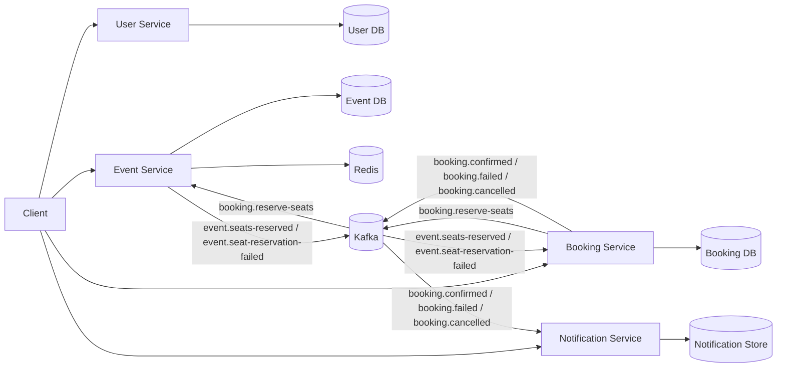

# Architecture

## Overview

This repository implements an event booking system as a small Node.js microservices platform. The goal is to keep the service boundaries clear while still demonstrating the core assessment requirements:

- user management
- event CRUD
- booking creation and lifecycle updates
- atomic seat reservation and release
- Redis cache-aside for event reads
- Kafka-based asynchronous workflows
- Docker and Kubernetes deployment support

The system is intentionally assessment-sized rather than a full enterprise platform.

## High-Level Flow

1. Client creates a user in the User Service.
2. Client creates an event in the Event Service.
3. Client creates a booking in the Booking Service.
4. Booking Service stores the booking as `PENDING` and publishes `booking.reserve-seats`.
5. Event Service consumes the reservation request and applies an atomic seat update.
6. Event Service publishes `event.seats-reserved` or `event.seat-reservation-failed`.
7. Booking Service consumes the response and transitions the booking to `CONFIRMED` or `FAILED`.
8. Booking Service publishes the final booking lifecycle event.
9. Notification Service consumes booking lifecycle events and records/logs them.

## Service Boundaries

### User Service

- Owns users and email uniqueness validation.
- Exposes `POST /users`, `GET /users/:id`, and `GET /users`.
- Exposes `/health/live` and `/health/ready`.
- Uses its own service-local database boundary.

### Event Service

- Owns event CRUD.
- Owns seat inventory counts and the atomic reservation/release logic.
- Owns Redis cache-aside for event reads.
- Consumes booking reservation and cancellation events.
- Publishes seat reservation success/failure events.
- Exposes `/health/live` and `/health/ready`.

### Booking Service

- Owns booking creation and status transitions.
- Supports idempotency keys for duplicate request protection.
- Publishes `booking.reserve-seats`.
- Consumes reservation success/failure events.
- Supports cancellation flow through `booking.release-seats`.
- Exposes `/health/live` and `/health/ready`.

### Notification Service

- Consumes booking lifecycle events.
- Stores or logs notifications for demo purposes.
- Exposes `/health/live` and `/health/ready`.

## Data Ownership

The current implementation follows a database-per-service approach where practical:

- User Service: SQLite file-backed database in the current implementation
- Event Service: PostgreSQL
- Booking Service: PostgreSQL
- Notification Service: in-memory notification store for the assessment flow

No service reads another service's database directly.

## Redis Ownership

Redis belongs to the Event Service only.

It is used as a cache, not as the source of truth, for event reads:

- cache key pattern: `event:{eventId}`
- cache-aside read path
- invalidation after event update, delete, reservation, and release

## Kafka Topics

Shared contracts live in [`packages/contracts`](../packages/contracts).

Current topics:

- `booking.reserve-seats`
- `event.seats-reserved`
- `event.seat-reservation-failed`
- `booking.release-seats`
- `booking.confirmed`
- `booking.failed`
- `booking.cancelled`

## Message Envelope

Messages use a shared envelope with metadata for traceability and idempotency:

- `messageId`
- `correlationId`
- `timestamp`
- `version`
- `payload`

This allows services to trace a booking workflow across Kafka consumers and to ignore duplicate deliveries safely.

## Race-Condition-Safe Seat Reservation

The critical correctness rule is that seat reservation must not use a read-check-write pattern.

Unsafe pattern:

1. read `availableSeats`
2. compare in application code
3. update later

That approach can oversell when concurrent requests read the same value.

The Event Service instead uses an atomic database update conceptually equivalent to:

```sql
UPDATE events
SET available_seats = available_seats - $1
WHERE id = $2
  AND available_seats >= $1
RETURNING *;
```

If no row is returned, the reservation failed safely.

The same idea is used for seat release, with a guard that prevents `availableSeats` from exceeding `totalSeats`.

## Idempotency

The booking flow uses two layers of idempotency:

- Booking Service stores client idempotency keys so duplicate HTTP requests return the same booking instead of creating another one.
- Kafka consumers record processed message IDs so redelivered messages do not repeat side effects.

This is important because Kafka delivery is at-least-once, not exactly-once.

## Reliability Pattern

The current implementation uses an assessment-sized outbox/inbox style approach:

- Booking Service persists booking changes and outbox records together.
- A dispatcher publishes pending outbox records to Kafka.
- Event Service and Booking Service record processed message IDs before applying duplicate-sensitive logic.

This keeps the implementation understandable while still handling crash/retry scenarios better than a fire-and-forget design.

## Deployment Topology

Local development and submission support are provided through:

- Dockerfiles per service
- `docker-compose.yml`
- Kubernetes manifests under `infrastructure/kubernetes/`
- Minikube helper scripts under `scripts/`

## Mermaid Diagram



## Current Tradeoffs

- User Service uses SQLite to keep the implementation compact.
- Notification Service keeps notifications lightweight instead of adding a separate persistence layer.
- Kafka introduces eventual consistency, so the booking response is asynchronous after the initial `PENDING` booking.
- The outbox/inbox style flow adds reliability but also adds a small amount of schema and dispatcher complexity.

## Summary

The implemented architecture favors:

- clear service boundaries
- database ownership per service
- atomic inventory updates
- cache-aside reads
- idempotent event handling
- demo-friendly infrastructure

That combination is enough to demonstrate the assignment goals without overbuilding the platform.
