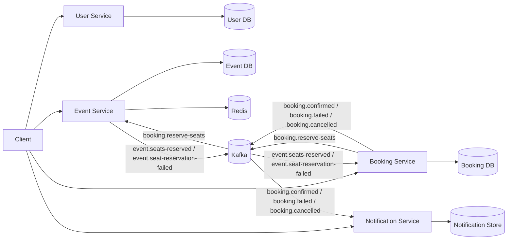

# Architecture

## System Context

The repository implements an event booking platform as a collection of four Node.js/TypeScript microservices. The primary goals are to demonstrate:
- Clear service boundaries with database-per-service.
- Safe concurrent seat inventory management.
- Reliable asynchronous workflows using Kafka with outbox/inbox patterns.
- Cache‑aside reads via Redis.
- Production‑ready containerization and Helm‑based Kubernetes deployment.

## Service Boundaries

| Service | Responsibility | Database | External Dependencies |
|---|---|---|---|
| **User Service** | User CRUD, email uniqueness validation | PostgreSQL (user‑db) | None |
| **Event Service** | Event CRUD, seat inventory, Redis cache‑aside, Kafka consumers/producers | PostgreSQL (event‑db) | Redis, Kafka |
| **Booking Service** | Booking creation, idempotency, state machine, outbox publishing | PostgreSQL (booking‑db) | Kafka |
| **Notification Service** | Consume booking lifecycle events, persist notifications for demo visibility | PostgreSQL (notification‑db) | Kafka |

## Data Ownership

Each service owns its database; no service reads another service's tables directly. The Notification Service now persists notifications in PostgreSQL (previously in‑memory) to provide durability across restarts.

## Data Flow

### Booking Workflow
1. **POST /bookings** creates a booking in **PENDING** state and publishes `booking.reserve-seats`.
2. **Event Service** consumes the request and performs an **atomic seat reservation** using a guarded `UPDATE` (see Race‑Condition Prevention).
3. On success it publishes `event.seats‑reserved`; on failure `event.seat‑reservation‑failed`.
4. **Booking Service** consumes the outcome, transitions the booking to **CONFIRMED** or **FAILED**, and publishes the corresponding lifecycle event.
5. **Notification Service** consumes the lifecycle event and stores a notification.

The flow is **eventually consistent**; the initial HTTP response returns the `PENDING` booking.

### Cancellation Workflow
1. A confirmed booking is cancelled via `POST /bookings/:id/cancel`.
2. The service publishes `booking.cancelled`.
3. **Event Service** consumes the cancellation and atomically releases the seats (`available_seats = available_seats + qty` guarded to stay ≤ `total_seats`).
4. A notification is emitted.

Concurrent cancellation is protected by the same atomic SQL guard and outbox row‑claiming.

## Inventory Invariants

- `0 ≤ available_seats ≤ total_seats`
- `reserved_seats = total_seats - available_seats`
- The sum of `available_seats` and `reserved_seats` always equals `total_seats`.

These invariants are enforced by PostgreSQL `CHECK` constraints and verified by the concurrency test suite.

## Atomic Reservation Algorithm

```sql
UPDATE events
SET available_seats = available_seats - $1
WHERE id = $2
  AND available_seats >= $1
RETURNING *;
```

If no rows are returned, the reservation fails safely.

## Atomic Capacity‑Update Algorithm (Seat Release)

```sql
UPDATE events
SET available_seats = LEAST(available_seats + $1, total_seats)
WHERE id = $2
  AND available_seats + $1 <= total_seats
RETURNING *;
```

## HTTP Idempotency

- **Idempotency‑Key** header on booking creation.
- Service stores a fingerprint of the request; duplicate keys with identical payload return the original booking.
- Duplicate keys with differing payload result in `409 IDEMPOTENCY_KEY_REUSED`.

## Kafka At‑Least‑Once Semantics

All messages are delivered at least once. The envelope includes `messageId`, `correlationId`, `timestamp`, `version`, and `payload`.

## Runtime Message Validation

Incoming messages are validated against Zod schemas generated from the shared contracts package. Invalid messages are logged and sent to a dead‑letter queue.

## Inbox Pattern

Each consumer records processed `messageId`s in an **inbox** table before applying side‑effects, guaranteeing idempotent handling of redelivered messages.

## Outbox Pattern

State changes and outbound messages are persisted together in an **outbox** table within the same transaction. A dispatcher worker claims pending rows using `FOR UPDATE SKIP LOCKED` and publishes them to Kafka.

## Multi‑Worker Row Claiming

Outbox workers run concurrently; the `SKIP LOCKED` clause ensures each row is processed by a single worker without contention.

## Retry / Backoff / DLQ

Failed outbox publishes transition to a `FAILED` state and are retried with exponential backoff. After a configurable number of attempts, the message is moved to a **DLQ** for manual inspection.

## Redis / Cache Failure Strategy

- Cache‑aside reads populate Redis on miss.
- Writes/updates invalidate the cache key.
- Fixed‑window rate limiting uses an atomic Lua script (`INCR` + `EXPIRE`).
- Cache failures are ignored (fail‑open) and the request falls back to PostgreSQL.

## Notification Persistence

Notifications are stored in PostgreSQL with a unique `processed_message_id` to deduplicate across replica consumers.

## Database Migrations

- Prisma migrations are **forward‑only**; each migration is immutable.
- CI runs migration tests against a fresh database and an upgrade path.
- Schema constraints enforce the inventory invariants.

## Health Model

- **Liveness** (`/health/live`): checks that the process is running.
- **Readiness** (`/health/ready`): verifies database connections, Kafka consumer subscriptions, and Redis connectivity.

## Metrics

Prometheus‑compatible metrics are exposed at `/metrics`, including:
- Request counters per endpoint.
- Kafka consumer lag.
- Redis hit/miss rates.
- Inventory invariant violation counters (should remain zero).

## Deployment Model

- **Docker Compose** for local development.
- **Helm** chart (`infrastructure/helm/event-booking`) for Kubernetes.
- **Kustomize** manifests are legacy; they are kept only for reference and are **not** a supported deployment path.

## Intentional Trade‑offs

- Single‑node Kafka, PostgreSQL, and Redis for assessment simplicity.
- Process‑local Prometheus counters reset on container restart.
- Readiness probes only verify consumer subscription, not a full broker round‑trip.
- Pagination endpoints omit total count to avoid expensive count queries.

---

*The architecture document now provides deeper technical detail without duplicating the README.*

## Overview

This repository implements an event booking system as a small Node.js microservices platform. The goal is to keep the service boundaries clear while still demonstrating the core assessment requirements:

- user management
- event CRUD
- booking creation and lifecycle updates
- atomic seat reservation and release
- Redis cache-aside for event reads
- Kafka-based asynchronous workflows
- Docker and Kubernetes deployment support

The system is intentionally assessment-sized rather than a full enterprise platform.

## High-Level Flow

1. Client creates a user in the User Service.
2. Client creates an event in the Event Service.
3. Client creates a booking in the Booking Service.
4. Booking Service stores the booking as `PENDING` and publishes `booking.reserve-seats`.
5. Event Service consumes the reservation request and applies an atomic seat update.
6. Event Service publishes `event.seats-reserved` or `event.seat-reservation-failed`.
7. Booking Service consumes the response and transitions the booking to `CONFIRMED` or `FAILED`.
8. Booking Service publishes the final booking lifecycle event.
9. Notification Service consumes booking lifecycle events and records/logs them.

## Service Boundaries

### User Service

- Owns users and email uniqueness validation.
- Exposes `POST /users`, `GET /users/:id`, and `GET /users`.
- Exposes `/health/live` and `/health/ready`.
- Uses its own service-local database boundary.

### Event Service

- Owns event CRUD.
- Owns seat inventory counts and the atomic reservation/release logic.
- Owns Redis cache-aside for event reads.
- Consumes booking reservation and cancellation events.
- Publishes seat reservation success/failure events.
- Exposes `/health/live` and `/health/ready`.

### Booking Service

- Owns booking creation and status transitions.
- Supports idempotency keys for duplicate request protection.
- Publishes `booking.reserve-seats`.
- Consumes reservation success/failure events.
- Supports cancellation flow through `booking.cancelled`.
- Exposes `/health/live` and `/health/ready`.

### Notification Service

- Consumes booking lifecycle events.
- Stores or logs notifications for demo purposes.
- Exposes `/health/live` and `/health/ready`.

## Data Ownership

The current implementation follows a database-per-service approach where practical:

- User Service: PostgreSQL
- Event Service: PostgreSQL
- Booking Service: PostgreSQL
- Notification Service: in-memory notification store for the assessment flow

No service reads another service's database directly.

## Redis Ownership

Redis belongs to the Event Service only.

It is used as a cache, not as the source of truth, for event reads:

- cache key pattern: `event:{eventId}`
- cache-aside read path
- invalidation after event update, delete, reservation, and release

## Kafka Topics

Shared contracts live in [`packages/contracts`](../packages/contracts).

Current topics:

- `booking.reserve-seats`
- `event.seats-reserved`
- `event.seat-reservation-failed`
- `booking.cancelled`
- `booking.confirmed`
- `booking.failed`
- `booking.cancelled`

## Message Envelope

Messages use a shared envelope with metadata for traceability and idempotency:

- `messageId`
- `correlationId`
- `timestamp`
- `version`
- `payload`

This allows services to trace a booking workflow across Kafka consumers and to ignore duplicate deliveries safely.

## Race-Condition-Safe Seat Reservation

The critical correctness rule is that seat reservation must not use a read-check-write pattern.

Unsafe pattern:

1. read `availableSeats`
2. compare in application code
3. update later

That approach can oversell when concurrent requests read the same value.

The Event Service instead uses an atomic database update conceptually equivalent to:

```sql
UPDATE events
SET available_seats = available_seats - $1
WHERE id = $2
  AND available_seats >= $1
RETURNING *;
```

If no row is returned, the reservation failed safely.

The same idea is used for seat release, with a guard that prevents `availableSeats` from exceeding `totalSeats`.

## Idempotency

The booking flow uses two layers of idempotency:

- Booking Service stores client idempotency keys so duplicate HTTP requests return the same booking instead of creating another one.
- Kafka consumers record processed message IDs so redelivered messages do not repeat side effects.

This is important because Kafka delivery is at-least-once, not exactly-once.

## Reliability Pattern

The current implementation uses an assessment-sized outbox/inbox style approach:

- Booking Service persists booking changes and outbox records together.
- A dispatcher publishes pending outbox records to Kafka.
- Event Service and Booking Service record processed message IDs before applying duplicate-sensitive logic.

This keeps the implementation understandable while still handling crash/retry scenarios better than a fire-and-forget design.

## Deployment Topology

Local development and submission support are provided through:

- Dockerfiles per service
- `docker-compose.yml`
- Kubernetes manifests under `infrastructure/kubernetes/`
- Minikube helper scripts under `scripts/`

## Mermaid Diagram



## Current Tradeoffs

- User Service uses PostgreSQL to keep the implementation aligned with the assessment requirements.
- Notification Service keeps notifications lightweight instead of adding a separate persistence layer.
- Kafka introduces eventual consistency, so the booking response is asynchronous after the initial `PENDING` booking.
- The outbox/inbox style flow adds reliability but also adds a small amount of schema and dispatcher complexity.

## Summary

The implemented architecture favors:

- clear service boundaries
- database ownership per service
- atomic inventory updates
- cache-aside reads
- idempotent event handling
- demo-friendly infrastructure

That combination is enough to demonstrate the assignment goals without overbuilding the platform.
